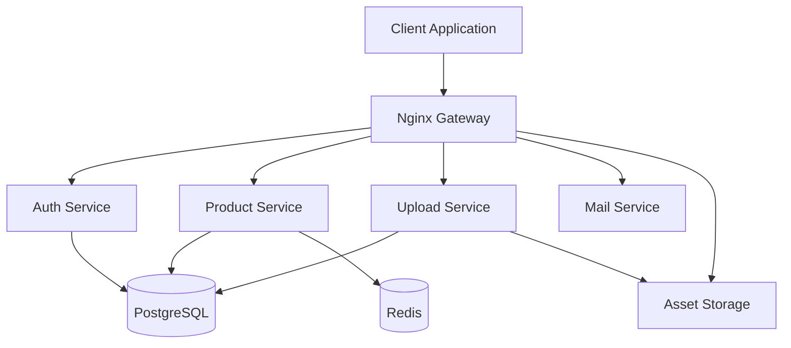

# PIM (Product Information Management) Platform 🚀

[](https://www.typescriptlang.org/)
[](https://reactjs.org/)
[](https://graphql.org/)
[](https://www.docker.com/)
[](https://www.postgresql.org/)

A modern, scalable Product Information Management system built with cutting-edge technologies. This platform provides a robust solution for managing product data, digital assets, and product relationships across multiple channels.

## 🌟 Key Features

- **Centralized Product Management**
  - Complete CRUD operations
  - Advanced product categorization
  - Tags and labels management
  - Digital asset management
  - Rich text product descriptions
  - Dynamic product attributes

- **Smart Search & Filtering**
  - Full-text search with PostgreSQL
  - Advanced filtering capabilities
  - Auto-suggestions
  - Search result ranking

- **User Management & Security**
  - Role-based access control (SysAdmin/Admin/Collaborator)
  - JWT authentication
  - Secure password handling
  - User activity tracking

- **Optimization & Performance**
  - Redis caching
  - SEO metadata management
  - Image optimization
  - Real-time updates

## 🏗️ Architecture

### Microservices Architecture

Static Assets Distribution
Nginx handles static asset distribution efficiently:

Product images and brand logos served directly
Optimal caching headers for assets
Automatic image compression and optimization
Secure file access control
Load balancing for high-traffic scenarios

### Technology Stack
- **Frontend**: React + Vite, Material-UI
- **API**: GraphQL with Apollo Server
- **Database**: PostgreSQL with TypeORM
- **Caching**: Redis
- **Services**: Node.js microservices
- **Gateway**: Nginx
- **Containerization**: Docker
- **CI/CD**: GitHub Actions

## 🚀 Getting Started

### Prerequisites
- Docker and Docker Compose
- Node.js (v18+)
- Git

### Installation

1. Clone the repository
```bash
git clone https://github.com/yourusername/pim-platform.git
cd pim-platform
```
2. Start the application
```bash
docker-compose up -d
```

The application will be available at:
- Frontend: http://localhost:8000
- GraphQL API: http://localhost:8000/api

## 🏗️ Project Structure

```
project-root/
├── client/                   # React frontend
├── services/                 # Microservices
│   ├── graphql-service/      # Main API
│   ├── mail-service/         # Email notifications
│   └── upload-service/       # Asset management
├── storage/                  # Storage configuration
│   ├── postgresql/          
│   └── redis/
├── nginx.conf                # Nginx configurations
├── deploy/                   # Deployment configs
└── docker/                   # Docker configurations
```

## 🔥 Key Technical Features

### Advanced Database Design
- Sophisticated PostgreSQL schema with UUID primary keys
- Full-text search implementation
- Efficient indexing strategy
- Database migrations and versioning

### Modern Frontend Architecture
- Component-based development with React
- Material-UI for consistent design
- Real-time updates with GraphQL subscriptions
- Responsive and mobile-first design

### Robust Backend Implementation
- GraphQL API with Type-GraphQL
- Efficient data loading with DataLoader
- Comprehensive error handling
- Request validation and sanitization

### DevOps Best Practices
- Docker containerization
- Nginx reverse proxy configuration
- Database backup and recovery
- Monitoring and logging setup

## 🛣️ Roadmap

- [ ] Enhanced caching strategy with Redis
- [ ] Advanced product import/export functionality
- [ ] Automated testing suite
- [ ] Analytics dashboard
- [ ] Enhanced search capabilities
- [ ] Multi-language support
- [ ] Bulk operations
- [ ] API rate limiting

## 📝 License

This project is licensed under the MIT License - see the [LICENSE](LICENSE) file for details.


---

Made with ❤️ and modern technologies.
