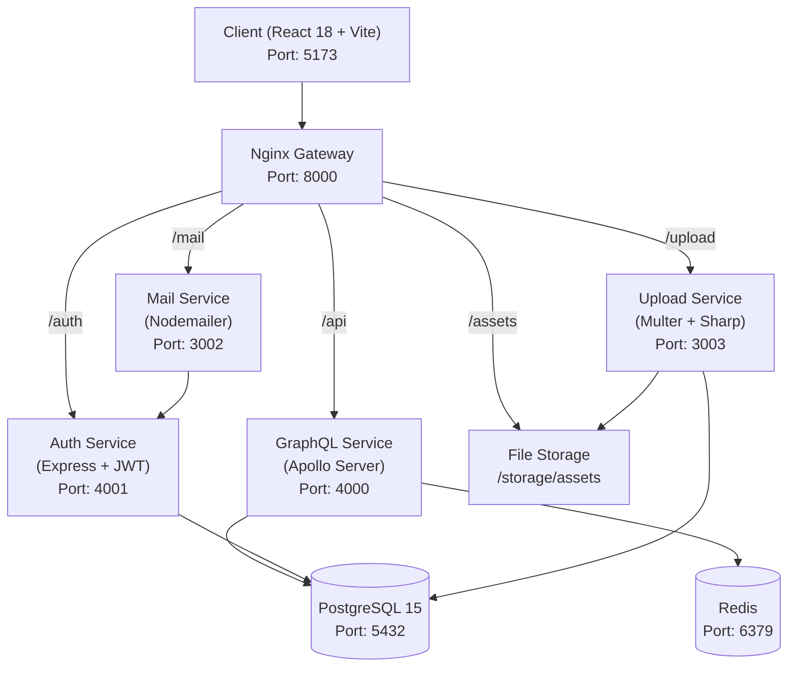

# PIM (Product Information Management) Platform 🚀

[](https://www.typescriptlang.org/)
[](https://reactjs.org/)
[](https://graphql.org/)
[](https://mui.com/)
[](https://redux-toolkit.js.org/)
[](https://www.docker.com/)
[](https://www.postgresql.org/)
[](https://redis.io/)
[](https://nodejs.org/)

A modern, enterprise-grade Product Information Management system showcasing advanced software architecture patterns. Built with TypeScript throughout, featuring microservices architecture, sophisticated caching strategies, and production-ready security implementations. Perfect demonstration of full-stack development expertise with modern DevOps practices.

## 🌟 Key Features

- **Sophisticated Product Management**

  - Complete CRUD operations with audit trails
  - Hierarchical category system with unlimited depth
  - Many-to-many tagging with intelligent suggestions
  - Multi-image asset management with primary designation
  - Rich text descriptions with metadata
  - **EAV pattern** for dynamic product characteristics
  - Brand relationship management with logo integration

- **Advanced Search & Intelligence**

  - PostgreSQL full-text search with pg_trgm extension
  - French language support with unaccent
  - Real-time search suggestions and auto-completion
  - Trigram-based fuzzy matching
  - Advanced filtering with complex criteria
  - Search result ranking and relevance scoring

- **Enterprise Security & User Management**

  - Role-based access control (SysAdmin/Admin/Collaborator)
  - JWT authentication with HTTP-only cookies
  - Temporal user access control (start/end dates)
  - Password encryption with bcrypt (salt rounds: 10)
  - Rate limiting and CORS protection
  - Comprehensive audit trail and activity tracking
  - Session validation and automatic token refresh

- **Performance & Scalability**
  - Advanced Redis caching with pattern-based invalidation
  - Cache metrics and performance monitoring
  - Image optimization with Sharp library
  - Database indexing with GIN and trigram indexes
  - Query optimization with TypeORM
  - Microservices architecture for horizontal scaling
  - NGINX load balancing and static asset serving

## 🏗️ Architecture

### Microservices Architecture

**5 Independent Services:**

- **Client Application** (React SPA) - Port 5173 → :8000
- **GraphQL Service** (Apollo Server) - Port 4000 → :8000/api
- **Auth Service** (Express.js) - Port 4001 → :8000/auth
- **Mail Service** (Nodemailer) - Port 3002 → :8000/mail
- **Upload Service** (Multer) - Port 3003 → :8000/upload


```mermaid
graph TD
    Client["Client (React 18 + Vite)\nPort: 5173"]
    Gateway["Nginx Gateway\nPort: 8000"]
    GraphQL["GraphQL Service\n(Apollo Server)\nPort: 4000"]
    Auth["Auth Service\n(Express + JWT)\nPort: 4001"]
    Upload["Upload Service\n(Multer + Sharp)\nPort: 3003"]
    Mail["Mail Service\n(Nodemailer)\nPort: 3002"]
    DB[("PostgreSQL 15\nPort: 5432")]
    Cache[("Redis\nPort: 6379")]
    Storage["File Storage\n/storage/assets"]

    Client --> Gateway
    Gateway -->|/api| GraphQL
    Gateway -->|/auth| Auth
    Gateway -->|/upload| Upload
    Gateway -->|/mail| Mail
    Gateway -->|/assets| Storage

    GraphQL --> DB
    GraphQL --> Cache
    Auth --> DB
    Upload --> DB
    Upload --> Storage
    Mail --> Auth
```

**Service Communication & Routing:**

- **Nginx reverse proxy** routes requests by path prefix
- **Docker internal networking** for service-to-service communication
- **Health checks** ensure service availability
- **Static asset serving** with optimal caching headers
- **Load balancing** ready for horizontal scaling

### Technology Stack

**Frontend Technologies:**

- **React 18.2.0** with TypeScript 5.6.2
- **Vite 6.0.1** for lightning-fast development
- **Material-UI 5.16.14** with Emotion styling
- **Redux Toolkit 2.5.0** for state management
- **Apollo Client 3.12.2** for GraphQL integration
- **React Router DOM 7.0.2** for navigation

**Backend Technologies:**

- **Node.js 18** (Alpine Linux containers)
- **Apollo Server 4.9.5** with Type-GraphQL 2.0.0-beta.3
- **Express.js 4.21.2** for REST services
- **TypeORM 0.3.17** for database operations
- **JWT 9.0.2** with HTTP-only cookies
- **Nodemailer 6.9.16** for email services

**Database & Caching:**

- **PostgreSQL 15** with UUID primary keys
- **Redis (Alpine)** with IORedis 5.5.0
- **Full-text search** with pg_trgm extension
- **GIN indexes** for JSONB and text search

**Security & Validation:**

- **bcrypt 5.1.1** for password hashing
- **Helmet 8.0.0** for security headers
- **Express Rate Limit 7.5.0** for rate limiting
- **Class Validator 0.14.0** for input validation

**DevOps & Infrastructure:**

- **Docker** with multi-stage builds
- **Nginx** reverse proxy with load balancing
- **Docker Compose** for orchestration
- **Winston 3.17.0** for structured logging

## 🚀 Getting Started

### Prerequisites

- Docker and Docker Compose
- Node.js (v18+)
- Git

### Installation

1. **Clone the repository**

```bash
git clone https://github.com/alexandreg67/pim.git
cd pim
```

2. **Start the application** (first time)

```bash
npm run dev:build
```

3. **Daily development** (faster startup)

```bash
npm run dev
```

### 📡 Service Endpoints

- **Frontend**: http://localhost:8000
- **GraphQL API**: http://localhost:8000/api
- **Authentication**: http://localhost:8000/auth
- **File Upload**: http://localhost:8000/upload
- **PostgreSQL**: localhost:5435 (for external tools)
- **Redis**: localhost:6379

### 🛠️ Development Commands

**Root Level:**

```bash
npm run dev          # Start all services
npm run dev:down     # Stop all services
npm run lint         # Lint client + services
npm run format       # Format all code
```

**Service Specific:**

```bash
# GraphQL Service
cd services/graphql-service
npm run test         # Run Jest tests
npm run lint         # ESLint check

# Auth Service
cd services/auth-service
npm run test:unit    # Unit tests
npm run test:e2e     # End-to-end tests

# Client
cd client
npm run codegen      # Generate GraphQL types
npm run build        # Production build
```

## 🏗️ Project Structure

```
project-root/
├── client/                          # React 18 + TypeScript frontend
│   ├── src/
│   │   ├── components/             # Reusable UI components
│   │   ├── pages/                  # Route components
│   │   ├── store/                  # Redux Toolkit store
│   │   ├── generated/              # Auto-generated GraphQL types
│   │   └── graphql/                # GraphQL queries/mutations
│   ├── tests/e2e/                  # Playwright E2E tests
│   └── package.json                # Frontend dependencies
├── services/                        # Microservices architecture
│   ├── graphql-service/            # Apollo Server + TypeORM
│   │   ├── src/resolvers/          # GraphQL resolvers
│   │   ├── src/entities/           # TypeORM entities
│   │   └── src/middleware/         # Auth & caching middleware
│   ├── auth-service/               # JWT authentication
│   │   ├── src/__tests__/          # Comprehensive test suite
│   │   └── src/controllers/        # Express controllers
│   ├── mail-service/               # Nodemailer email service
│   └── upload-service/             # Multer file upload + Sharp
├── storage/                         # Data persistence
│   ├── postgres/                   # Database initialization
│   │   ├── init/                   # Schema + seed data
│   │   └── migrations/             # Database migrations
│   ├── redis/                      # Cache configuration
│   └── assets/                     # Static file storage
├── deploy/                          # Environment configurations
│   ├── dev/docker-compose.yml      # Development setup
│   └── prod/docker-compose.yml     # Production setup
├── nginx.conf                       # Reverse proxy configuration
└── CLAUDE.md                        # AI assistant guidance
```

## 🔥 Advanced Technical Features

### 🗄️ Sophisticated Database Architecture

- **PostgreSQL 15** with UUID primary keys throughout
- **Full-text search** with `pg_trgm` and French language support
- **JSONB audit trails** for complete change history
- **EAV pattern** for dynamic product characteristics
- **GIN indexes** for optimal query performance
- **Soft delete pattern** with TypeORM `@DeleteDateColumn`
- **Complex relationships** with proper foreign key constraints

### ⚡ High-Performance Caching

- **Redis caching layer** with intelligent cache invalidation
- **Pattern-based cache clearing** (e.g., `products:list:*`)
- **Cache metrics monitoring** with hit/miss ratios
- **Configurable TTL** (default: 1 hour for entities)
- **Composite cache keys** for complex queries

### 🎯 Modern Frontend Architecture

- **React 18** with concurrent features
- **TypeScript strict mode** for type safety
- **GraphQL Code Generator** for automatic type generation
- **Redux Toolkit** with RTK Query integration
- **Material-UI v5** with custom theming
- **Responsive design** with CSS-in-JS

### 🛡️ Enterprise Security

- **JWT tokens** in HTTP-only cookies
- **Role-based access control** with temporal validity
- **bcrypt password hashing** (10 salt rounds)
- **Rate limiting** per endpoint
- **CORS protection** and security headers
- **Input validation** with class-validator
- **SQL injection prevention** via TypeORM

### 🏗️ Microservices Excellence

- **Clean service boundaries** with single responsibilities
- **Inter-service communication** via HTTP APIs
- **Service discovery** through Docker networking
- **Independent deployments** and scaling
- **Centralized logging** with Winston
- **Health checks** for all services

### 📊 Performance Monitoring

- **Query execution time tracking**
- **Cache performance metrics**
- **GraphQL operation profiling**
- **Database query optimization**
- **Response time monitoring**

## 🚀 Features Implemented

- [x] **Advanced Redis caching** with pattern invalidation
- [x] **Full-text search** with PostgreSQL pg_trgm
- [x] **Comprehensive test suite** (unit, integration, E2E)
- [x] **Role-based security** with temporal access control
- [x] **Audit logging** with JSONB metadata
- [x] **Image optimization** with Sharp library
- [x] **Rate limiting** and security headers
- [x] **Database migrations** and seeding
- [x] **Docker containerization** with multi-environment support
- [x] **GraphQL API** with auto-generated TypeScript types

## 🛣️ Future Enhancements

- [ ] Real-time notifications with WebSockets
- [ ] Advanced analytics dashboard with charts
- [ ] Product import/export (CSV, JSON, XML)
- [ ] Multi-language content management
- [ ] Elasticsearch integration for advanced search
- [ ] CDN integration for global asset delivery
- [ ] GraphQL subscriptions for real-time updates
- [ ] API versioning and backward compatibility

## 🤝 Contributing & Development

**Local Development Setup:**

```bash
# First time setup
git clone https://github.com/alexandreg67/pim.git
cd pim
npm run dev:build  # Builds all containers

# Daily development
npm run dev        # Quick start with existing images
```

**Testing Commands:**

```bash
# Run service-specific tests
cd services/auth-service && npm run test

# Service-specific testing
cd services/auth-service && npm run test:unit
cd services/auth-service && npm run test:integration
cd services/graphql-service && npm run test
```

**Code Quality:**

```bash
npm run lint       # Check all services
npm run format     # Format with Prettier
```

## 📝 License

This project is open source and available for portfolio demonstration.

---

## 🏆 Code Quality & Testing

**Testing Strategy:**

- **Unit Tests**: Jest with TypeScript for business logic
- **Integration Tests**: Database and API endpoint testing
- **E2E Tests**: Playwright setup for critical user journeys
- **Type Safety**: Strict TypeScript with 100% type coverage
- **Code Quality**: ESLint + Prettier with pre-commit hooks

**Performance Targets & Optimizations:**

- **Cache Hit Ratio**: >90% target for frequently accessed data
- **Database Query Time**: <50ms target for product searches (with proper indexing)
- **API Response Time**: <200ms target for complex GraphQL queries
- **Frontend Bundle**: Optimized with Vite tree-shaking and code splitting
- **Docker Build**: Multi-stage builds for minimal image sizes

**Development Excellence:**

- **TypeScript Strict Mode**: Maximum type safety
- **Auto-generated Types**: GraphQL → TypeScript pipeline
- **Hot Module Replacement**: Sub-second dev server reload
- **Database Migrations**: Version-controlled schema changes
- **Comprehensive Logging**: Structured logs with Winston

---

**Built with enterprise-level architecture and modern development practices.** 🚀
